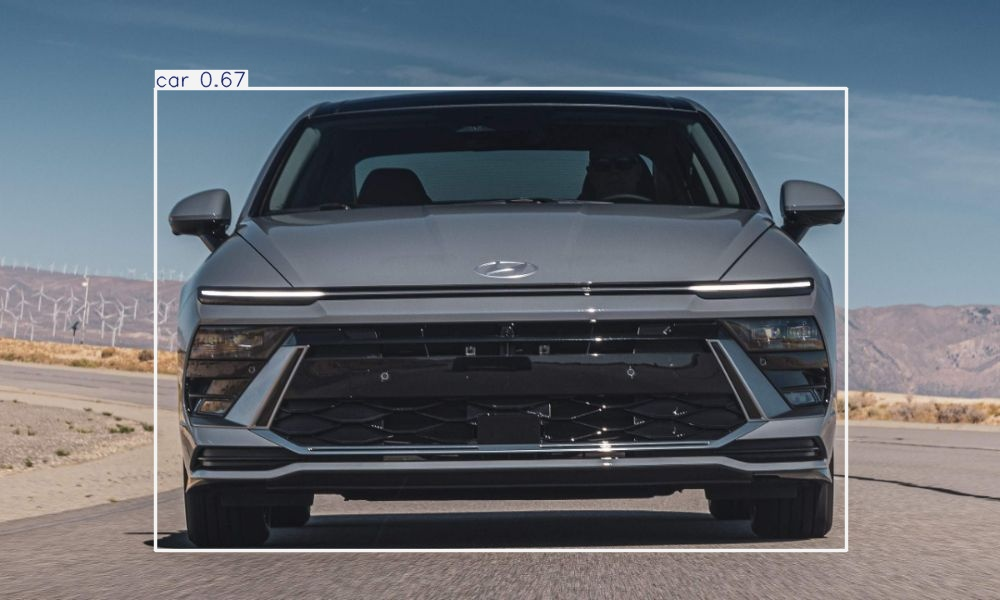

# 🚗 Vehicle Detection using YOLOv8

A powerful computer vision project that detects vehicles in images and videos using YOLOv8 and OpenCV.

---

## 📌 Features

- 🚘 Detect vehicles (car, bike, bus, truck)
- 🖼️ Image detection (multiple images support)
- 🎥 Video detection (local video support)
- 📊 Vehicle count per image/frame
- 💾 Output images saved with bounding boxes
- 📝 Log file generation

---

## 🛠️ Tech Stack

- Python
- YOLOv8 (Ultralytics)
- OpenCV
- Matplotlib

---

## 📁 Project Structure

vehicle-detection-yolo/
├── vehicle_detection.ipynb
├── app.py
├── yolov8n.pt
├── images/
│   ├── test1.jpg
│   ├── test2.jpg
├── outputs/
├── log.txt
├── requirements.txt
|── test.mp4
└── README.md

---

## ⚙️ Installation

pip install -r requirements.txt

---

## ▶️ How to Run

### 🧠 Option 1: Jupyter Notebook

jupyter notebook

👉 Open `vehicle_detection.ipynb`  
👉 Run all cells

---

### 💻 Option 2: Python Script

python app.py

---

## 🎯 Usage

After running, choose mode:

1 -> Image Detection  
2 -> Video Detection  

---

## 📸 Output

- Processed images saved in `outputs/`

- Vehicle count displayed
- Logs stored in `log.txt`

---

## ⚠️ Notes

- Video file (`test.mp4`) is used only locally (not uploaded to GitHub)
- Ensure `yolov8n.pt` model file is present

---

## 🚀 Future Improvements

- Real-time webcam detection
- Object tracking (DeepSORT)
- Streamlit web app
- Cloud deployment

---

## 👨‍💻 Author

Sivaguru Arumugam

---

## ⭐ Support

If you like this project, give it a ⭐ on GitHub!