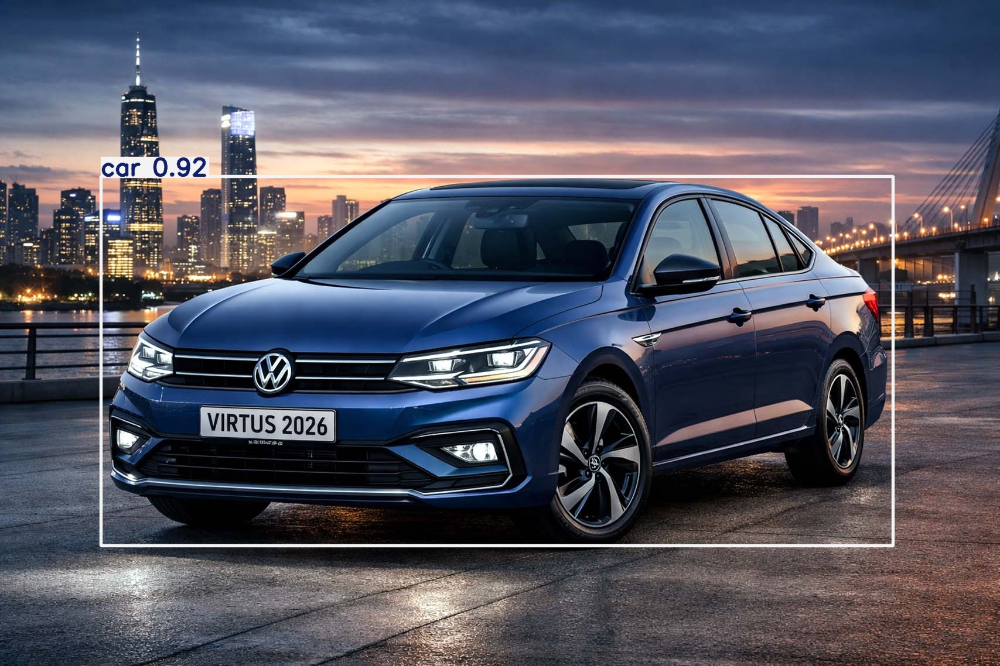

# 🚗 Vehicle Detection using YOLOv8

A real-time vehicle detection system built using YOLOv8 and OpenCV.
This project detects vehicles in images and displays bounding boxes with confidence scores.

---

## 🚀 Features

* 🚗 Detect vehicles in images
* 📦 Draw bounding boxes around detected objects
* 📊 Display confidence score
* ⚡ Fast detection using YOLOv8
* 🖼️ Output image saved automatically

---

## 🛠️ Tech Stack

* 🐍 Python
* 🤖 YOLOv8 (Ultralytics)
* 📸 OpenCV
* 📊 Matplotlib

---

## 📁 Project Structure

vehicle-detection-yolo/
├── app.py
├── vehicle_detection.ipynb
├── requirements.txt
├── README.md
├── test.jpg
├── output.jpg

---

## ⚙️ Installation

pip install -r requirements.txt

---

## ▶️ Run the Project

### Option 1: Jupyter Notebook

jupyter notebook

Open: vehicle_detection.ipynb

---

### Option 2: Python Script

python app.py

---

## 📸 Output

---

## 📌 How It Works

1. Load YOLOv8 pretrained model
2. Read input image
3. Run object detection
4. Draw bounding boxes
5. Display and save output image

---

## ❗ Note

* Do NOT upload yolov8n.pt model file to GitHub
* Install dependencies before running
* Works best with clear images

---

## 💡 Future Improvements

* 🎥 Real-time video detection
* 🎯 Custom dataset training
* 🌐 Web app deployment

---

## 📖 Tamil Explanation

* Vehicle Detection → வாகனங்களை கண்டறிதல்
* Bounding Box → பொருளை சுற்றி வரையப்படும் பெட்டி
* Confidence Score → கண்டறிதல் நம்பகத்தன்மை

---

## ⭐ Conclusion

This project demonstrates how YOLOv8 can be used for fast and accurate vehicle detection using Python.
